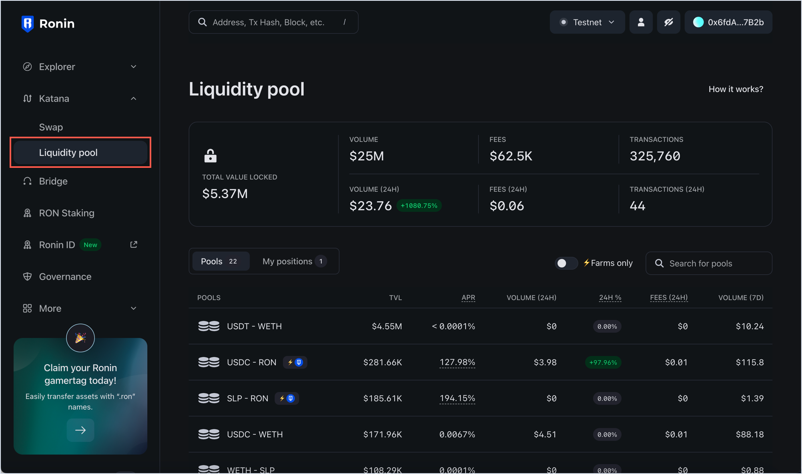
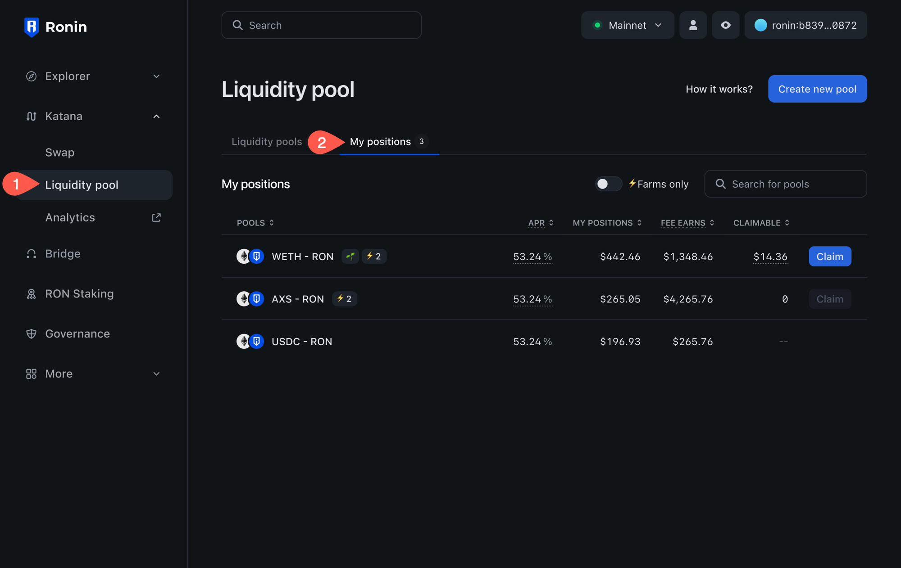
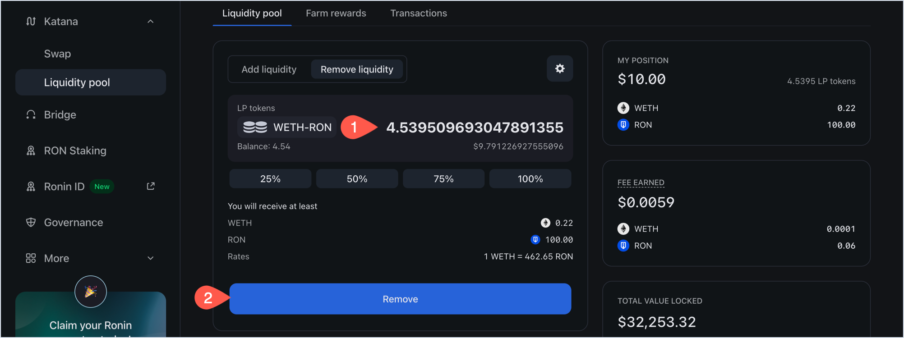

## Overview

You can add more liquidity to an existing pool on Katana to earn fees from transactions. When you contribute liquidity to a pool, you receive liquidity pool (LP) tokens in return. These tokens represent your share in the pool and entitle you to a portion of the trading fees generated by the pool's transactions, directly proportional to your contribution.
You can also remove your liquidity from a pool at any time. Removing pool tokens converts your position back into underlying tokens at the current rate, proportional to your share of the pool. Accrued fees are included in the amounts you receive.

## Add liquidity to a pool

1. Open [Katana](https://app.roninchain.com/swap) and connect your Ronin Wallet.
2. Select the **Liquidity pool** page, then open the pool you want to contribute to.
    
3. Enter the amount of tokens you want to contribute, then click **Add**. Katana automatically calculates the equivalent amount of the other token based on the current exchange rate. You may need to approve both tokens in your Ronin Wallet if you interact with them for the first time.

    

4. Review the details of your liquidity contribution:
    * The amount of LP tokens you will get in return.
    * The amount of tokens you are contributing.
    * The share of the pool you will receive.

    Click **Confirm add liquidity**, then confirm the transaction in your Ronin Wallet.

   

Your transaction is now submitted to the blockchain. When it completes, Katana displays a confirmation pop-up. Close it or click **View on explorer** to see the detailed information about the transaction.

The **My position** panel is now updated with your latest contribution:

* The amount of ERC-20 tokens you contributed.
* The amount of LP tokens received in return.

## View your positions

To see all the pools you contributed to and the fees earned, open the **Liquidity pool** page, then select **My positions**.

Here you can see the following information:

* The pools to which you contributed.
* The annual percentage rate (APR) for each pool.
* Your position in each pool.
* The fees you earned from each pool.
* Your claimable rewards from farming, if the pool supports it.

To view more details, such as the amount of LP tokens and the pool's performance over time, select each pool.

## Remove liquidity from a pool

1. Open the **Liquidity pool** page, then select the pool from which you want to withdraw liquidity. 

    

2. Select the **Remove liquidity** panel.

    

3. Select the portion of your liquidity you want to remove, or enter the amount manually. Then, click **Remove**.

    

4. Review how much you're getting when removing liquidity, then click **Confirm remove liquidity** and confirm the transaction in your Ronin Wallet.

    

Your transaction is now submitted to the blockchain. When it completes, Katana displays a confirmation pop-up. Close it or click **View on explorer** to see the detailed information about the transaction.

The **My position** panel is now updated with your latest position after removing liquidity:

You have now removed your liquidity by removing your LP tokens, and have gotten your tokens with the accrued fees, proportionate to your shares. Thank you for your service.
