## Overview

You can add more liquidity to an existing pool on Katana to earn fees from trades. When you contribute liquidity to a pool, you receive liquidity pool (LP) tokens as proof of your contribution. In Katana V2, you receive fungible LP tokens that represent a fixed share of the entire pool. In V3, instead, you receive a position tokens which are represented by non-fungible tokens (NFTs) that tied to the specific price range of your liquidity. The pool's fees are also distributed in different ways, depending on the pool is V2 or V3. In V2, fees are distributed based on the amount of LP tokens held. In V3, fees are allocated to positions where the swap price is active in the range they cover, and are also proportional to the liquidity those positions provide.
You can also remove your liquidity from a pool at any time. Removing pool tokens converts your position back into underlying tokens at the current rate. Accrued fees are included in the amounts you receive. Note that fees in V3 are not automatically reinvested like in V2, so you need to claim them separately.

## Add liquidity to a pool
Open the [Liquidity pool](https://app.roninchain.com/liquidity) page and connect your Ronin Wallet.

### For Katana V2 pools
1. Select the **V2 Pools** tab, then open the pool you want to contribute to.
    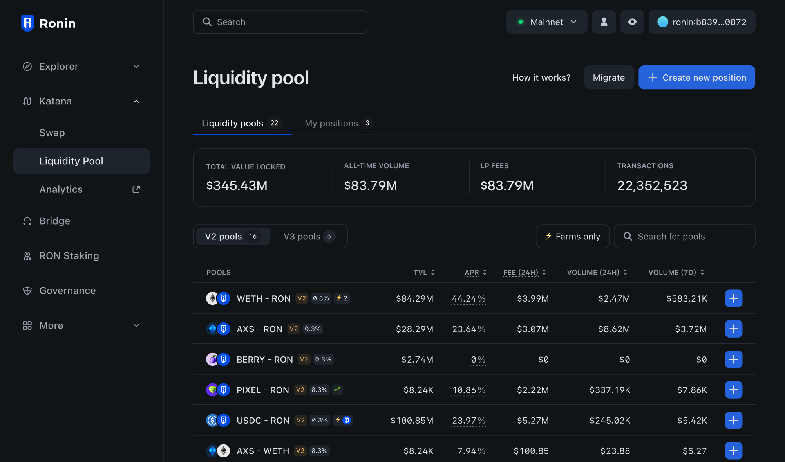

2. Enter the amount of tokens you want to contribute, then click **Add**. Katana automatically calculates the equivalent amount of the other token based on the current exchange rate. You may need to approve both tokens in your Ronin Wallet if you interact with them for the first time.

    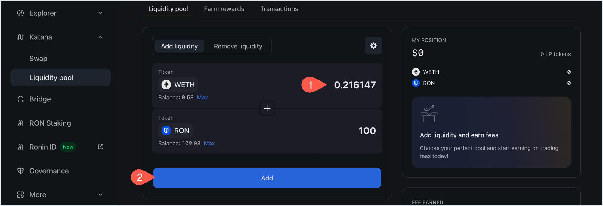

3. Review the details of your liquidity contribution:
    * The amount of LP tokens you will get in return.
    * The amount of tokens you are contributing.
    * The share of the pool you will receive.

    Click **Confirm add liquidity**, then confirm the transaction in your Ronin Wallet.

   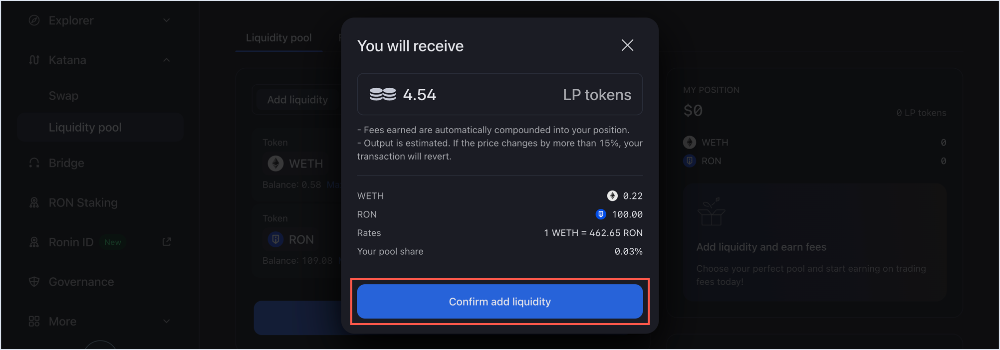

Your transaction is now submitted to the blockchain. When it completes, Katana displays a confirmation pop-up. Close it or click **View on explorer** to see the detailed information about the transaction.

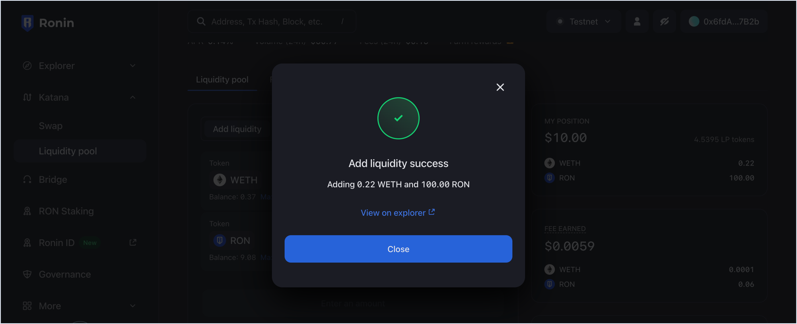

The **My position** panel is now updated with your latest contribution:

* The amount of ERC-20 tokens you contributed.
* The amount of LP tokens received in return.

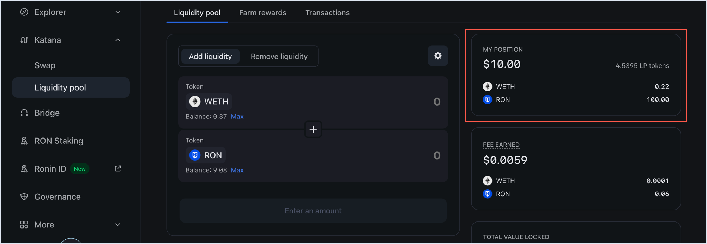

### For Katana V3 pools
1. Select the **V3 Pools** tabs, then open the pool you want to contribute to.
    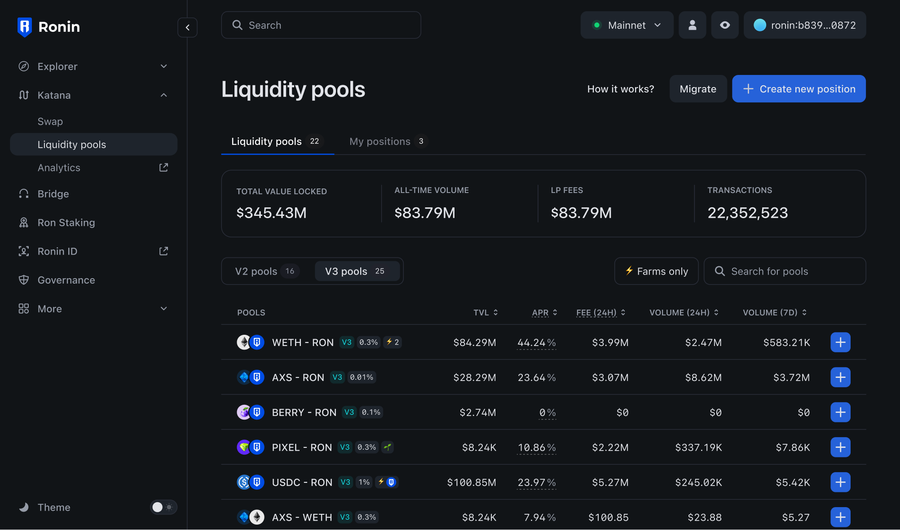

2. Select the fee tier for your position. If the pool with the selected fee tier does not exist, your position will create a new pool with the fee tier.
    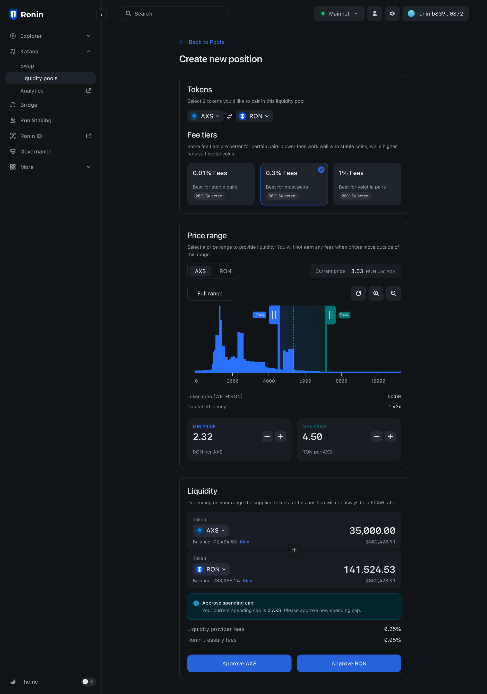

3. Enter or adjust the price range your position will provide liquidity for. Note that the minimum and maximum price values are rounded to the nearest tick price. You also see the capital efficiency of your position, which is the amount of liquidity your position provides compared to the liquidity when you provide for the full price range.

    If the pool price is in the range of your position, your position will earn fees from the pool. If the price moves out of the range, your position will not earn fees and be concentrated to one of two tokens.

    When your price range is above or below the current pool price, your position is called single-sided liquidity. It provides liquidity for only one token, and you will earn fees from the pool when the price moves to your range.
If you intend to remove the position once the price has crossed the range and the position has been converted to the other token, this strategy is treated as a range order.
    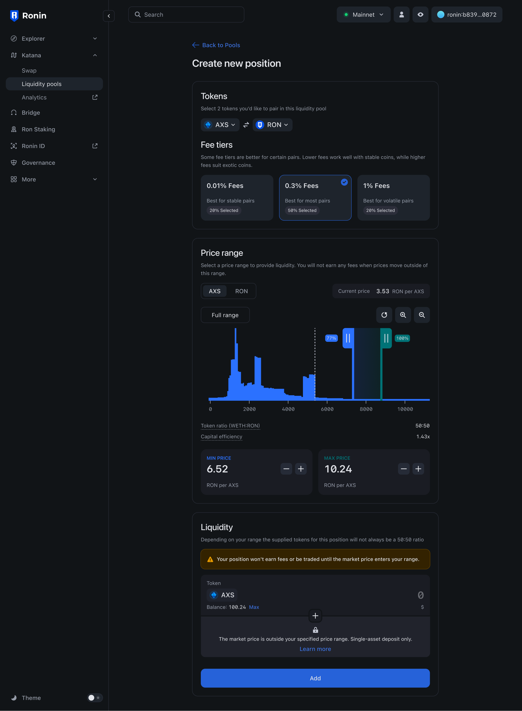

4. Enter the amount of tokens you want to contribute, then click **Add**. Katana automatically calculates the equivalent amount of the other token based on the current pool price and the price range of your position. You may need to approve both tokens in your Ronin Wallet if you interact with them for the first time.

5. Preview the details of your liquidity contribution:
    * The amount of tokens you are contributing.
    * The price range of your position.

    Click **Add liquidity**, then confirm the transaction in your Ronin Wallet.

   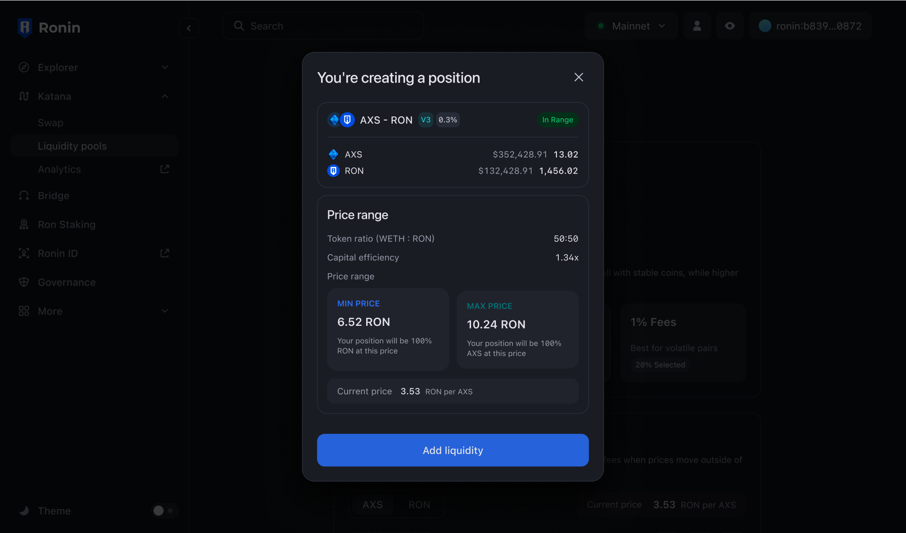

## View your positions

To see all the pools you contributed to and the fees earned, open the **Liquidity pool** page, then select **My positions**.

Here you can see the following information:
* With V2 pools
    * The pools to which you contributed.
    * The annual percentage rate (APR) for each pool.
    * Your position in each pool.
    * The fees you earned from each pool.
    * Your claimable rewards from farming, if the pool supports it.

* With V3 pools
    * The pools to which you contributed.
    * The price range of your position.
    * Your position size in each pool and price range respectively.
    * The fees you collected from each pool.
    * The fees you have not collected yet.
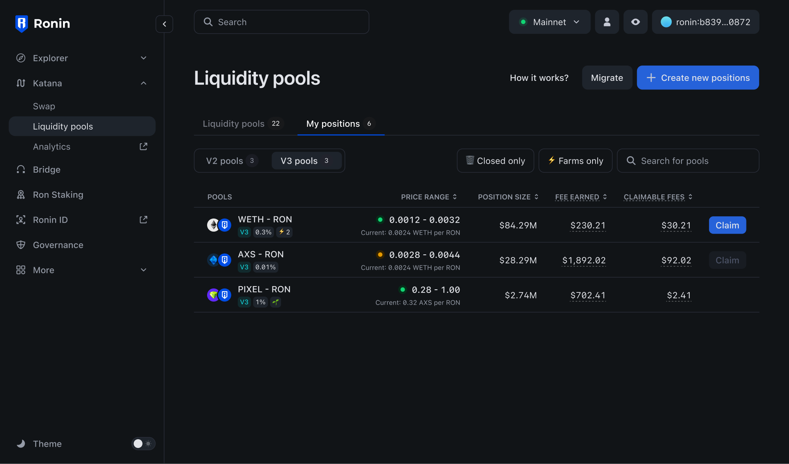

To view more details, such as the amount of LP tokens and the pool's performance over time, select each pool.

## Remove liquidity from a pool

1. Select the position you want to remove liquidity from in the **My positions** tab as described above.

2. Select the **Remove** liquidity panel.

    

3. Select the portion of your liquidity you want to remove, or enter the amount manually (V2), or adjust the percentage (v3). Then, click **Remove**.

4. Review how much you're getting when removing liquidity, then click **Remove liquidity** and confirm the transaction in your Ronin Wallet.

    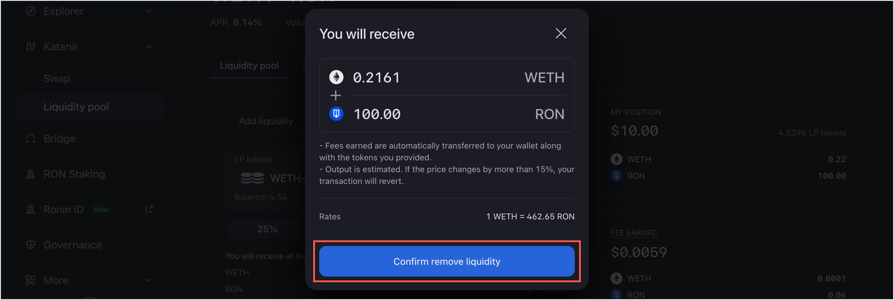

Your transaction is now submitted to the blockchain. When it completes, Katana displays a confirmation pop-up. Close it or click **View on explorer** to see the detailed information about the transaction.

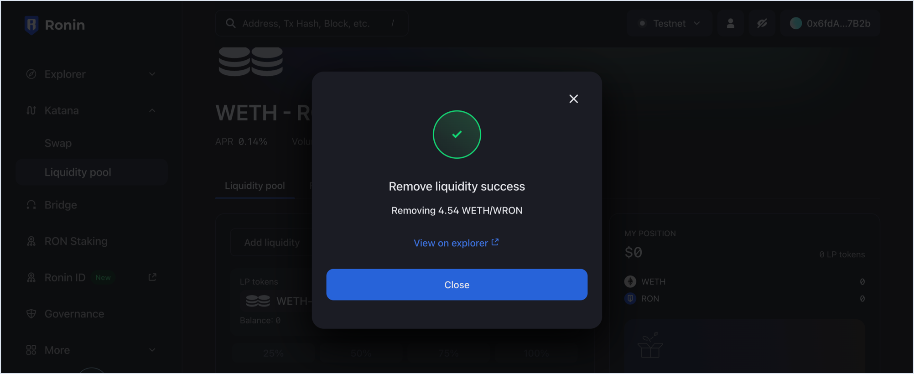

The **My position** panel is now updated with your latest position after removing liquidity:

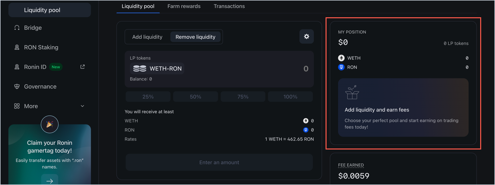

You have now removed your liquidity, and have gotten your tokens with the accrued fees, proportionate to your shares. Thank you for your service.
