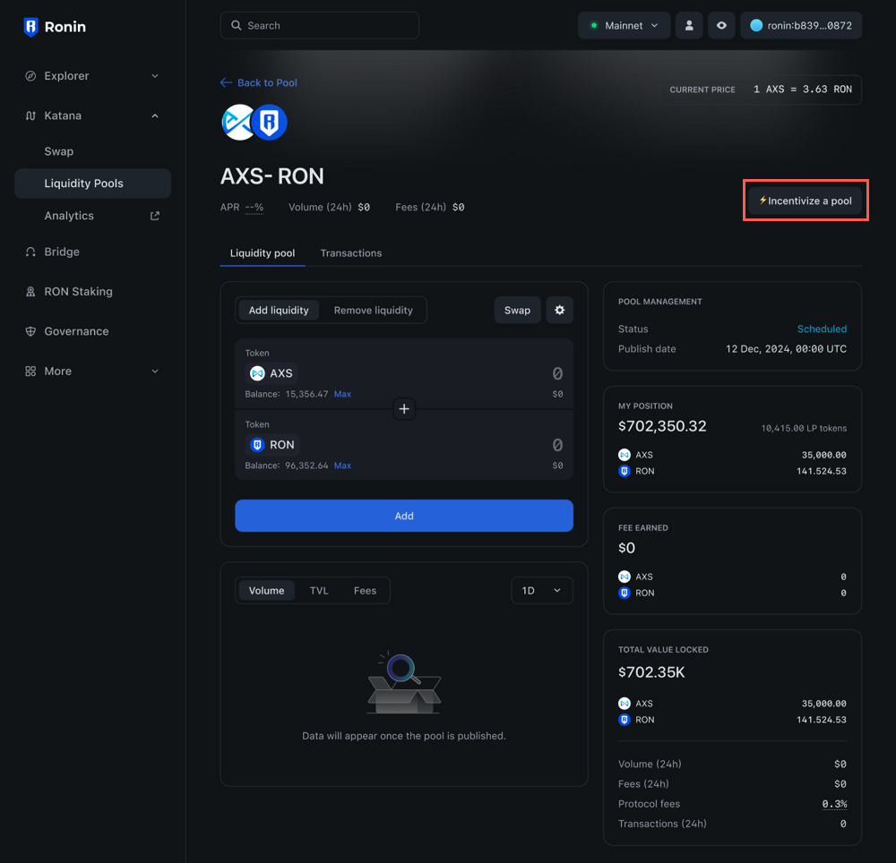
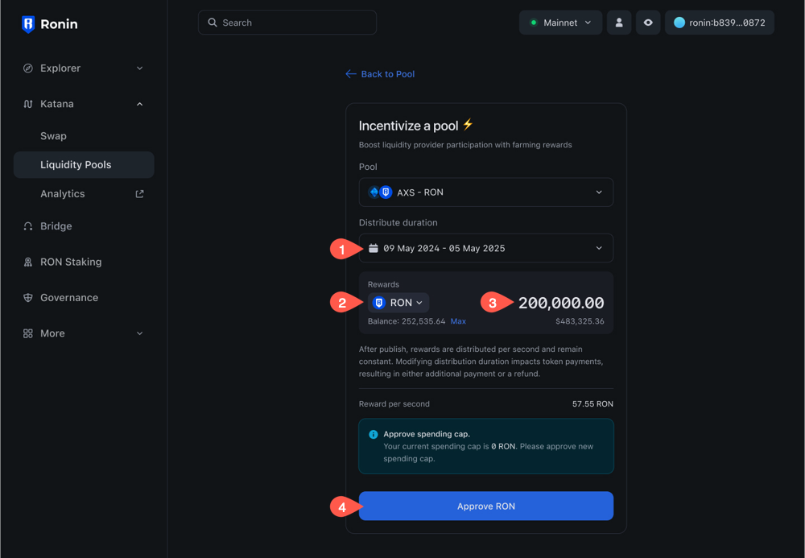
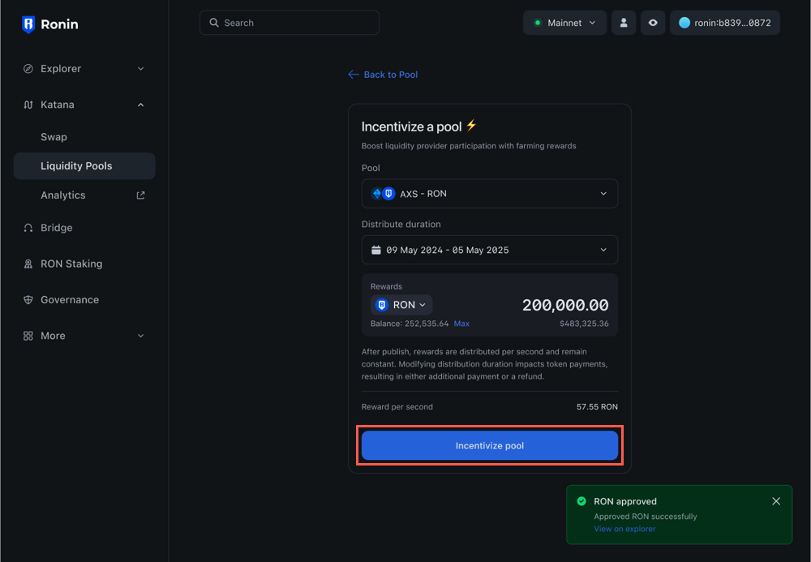
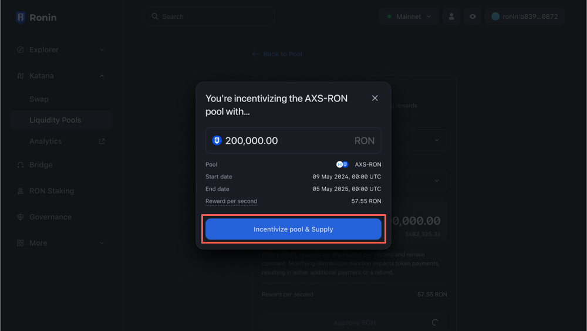
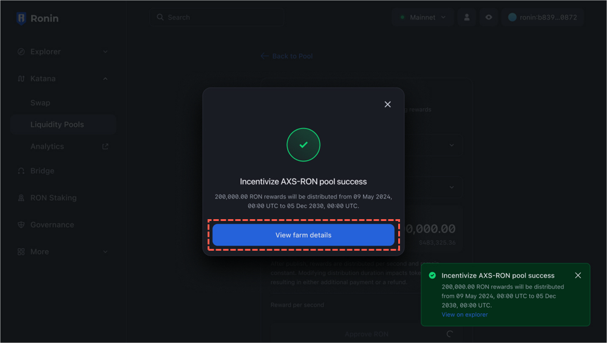
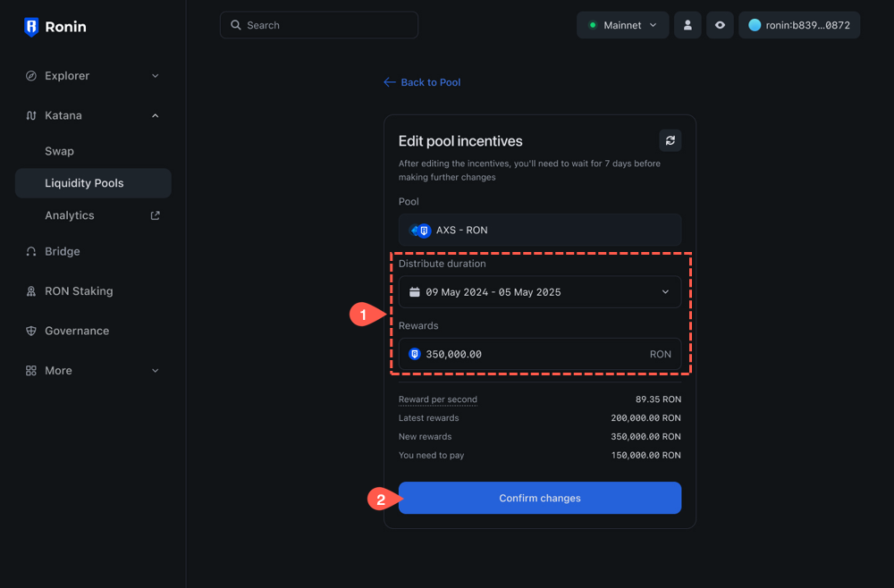
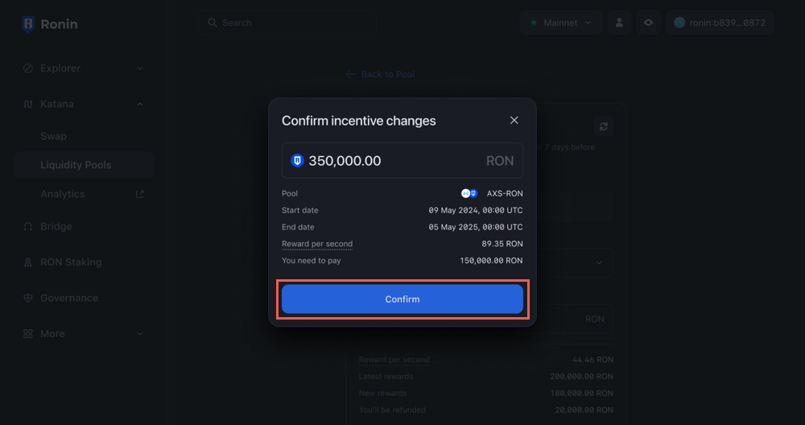
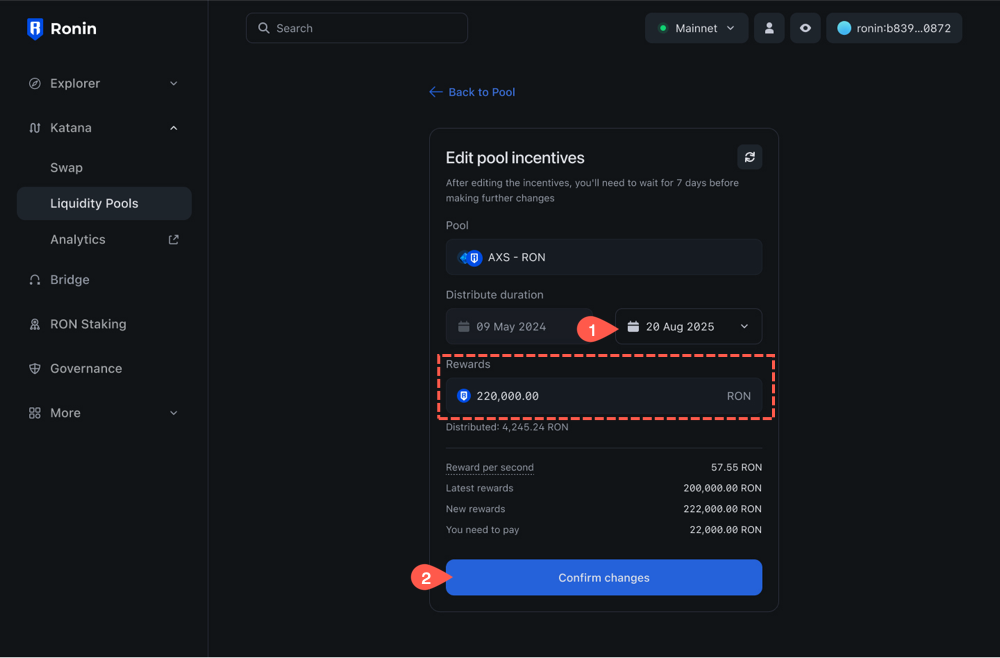
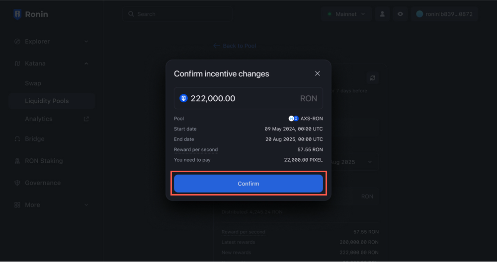

## Overview

This guide is for token creators who want to create a farm on Katana to encourage users to contribute liquidity to their pool. A farm is a way for users to earn rewards by staking their liquidity pool (LP) tokens. When users see that your pool offers farm rewards, they're encouraged to provide more liquidity, which increases the trading volume of the pool and reduces slippage when users swap the pool's tokens.

An important metric for farms is the rewards per second. This metric shows how much of the reward token is distributed to all users per second. The rewards per second are calculated based on the total reward amount and the farm duration. Changing the farm duration or the reward amount affects the rewards per second, resulting in a top-up from your wallet or a refund.

## Prerequisites

* Only _whitelisted_ Ronin addresses can create farms. To get whitelisted, submit your Ronin address to Sky Mavis. This address will be linked to our farm contract. **Note:** this address can be the same as the one you used for pool creation, but you still need to get it whitelisted for farm creation.
* A liquidity pool with your ERC-20 token created on Katana. For more information, see [Create a liquidity pool](create-pool.mdx).

## Create a farm

1. Go to [Katana](https://app.roninchain.com/liquidity) and connect your whitelisted Ronin address for farm creation. This address can be the same as the one you used for pool creation, or a different one.
1. On the **Liquidity pool** page, select the pool you want to create a farm for, then click **Incentivize a pool**.
  
2. In the **Incentivize a pool** section, configure the farm rewards:
   * Set the start and end dates for reward distribution. The start date must be at least 7 days in the future.
   * Select the token you want to distribute as a reward, and enter the amount. You may need to approve the spending cap for the token in your Ronin Wallet.
   
3. Click **Incentivize pool** to finish configuring your farm.
  
4. Click **Incentivise pool & Supply**, then confirm the transaction in your Ronin Wallet.
  

Your farm is now created and scheduled for publishing on the start date. As long as the farm is in a scheduled state, only you can see it. On the start date, the farm becomes visible to everyone.

Click **View farm details** to see the farm details and if you need to, edit the duration or the reward amount of the farm before it's published. 

## Edit a farm

### Edit a scheduled farm

Before your farm is published, you can change the initial reward amount and adjust the period over which the rewards are distributed. Depending on the changes you make, you may need to top up the initial reward amount or receive a refund if the required amount is less than the initial reward.

1. Go to [Katana](https://app.roninchain.com/liquidity) and connect your whitelisted Ronin address for farm creation.
2. On the **Liquidity pool** page, select the scheduled farm that you want to edit, then click **Incentivize a pool**.
3. In the **Edit pool incentives** section, modify the farm duration or reward amount. Then, click **Confirm changes**.
  
4. Review the amount of tokens you need to top up or receive due to the changes, then press **Confirm**, and then confirm the transaction in your Ronin Wallet.
  

### Edit a published farm

After publishing your farm, you can extend its reward distribution period or end it earlier. If you decide to extend the farm, the system will calculate the amount of rewards you need to pay on top of the initial rewards. If you want to end the farm earlier, the system will issue a refund for the remaining rewards.

1. Go to [Katana](https://app.roninchain.com/liquidity) and connect your whitelisted Ronin address for farm creation.
2. On the **Liquidity pool** page, select the published farm that you want to edit, then click **Incentivize a pool**.
3. In the **Edit pool incentives** section, edit the end date. Then, click **Confirm changes**.
  
4. Click **Confirm changes**, review the details, then confirm the transaction in your Ronin Wallet.
  
