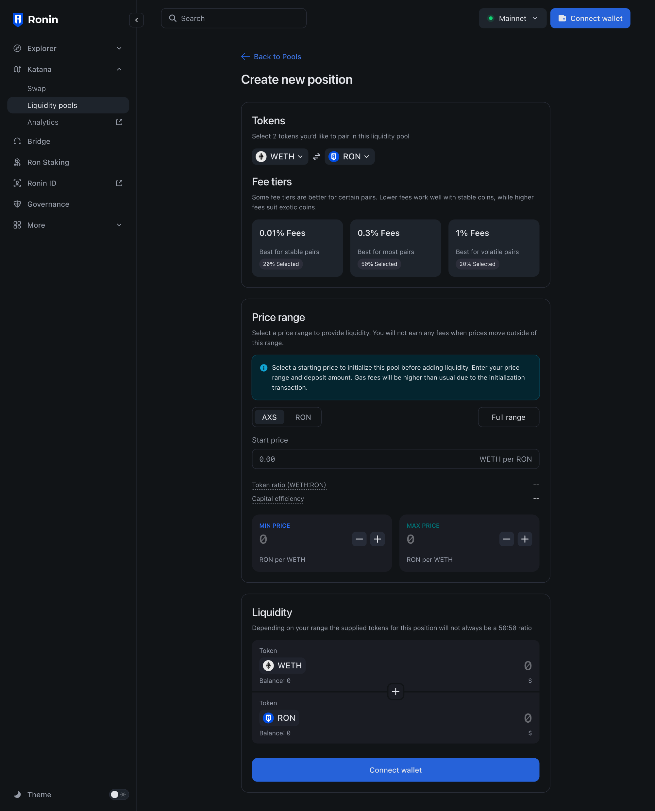
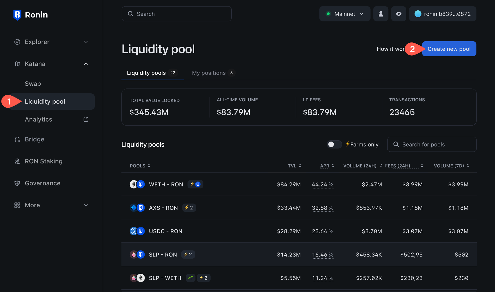
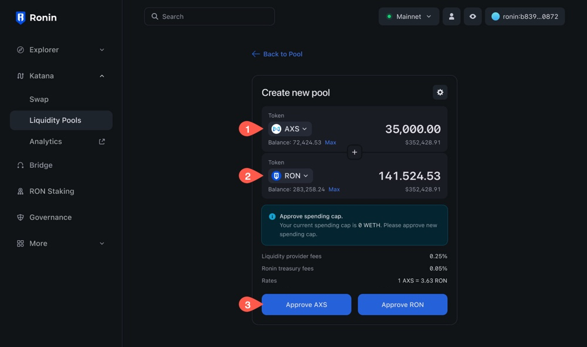
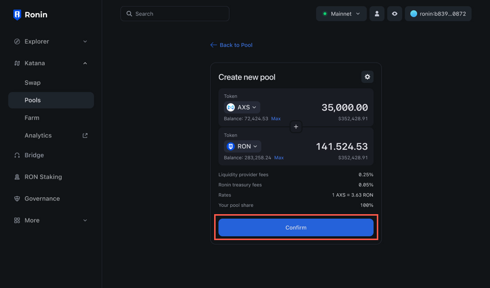
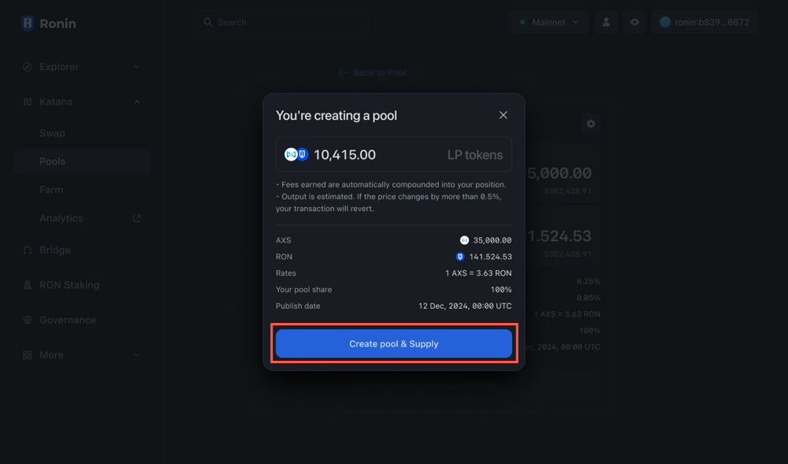
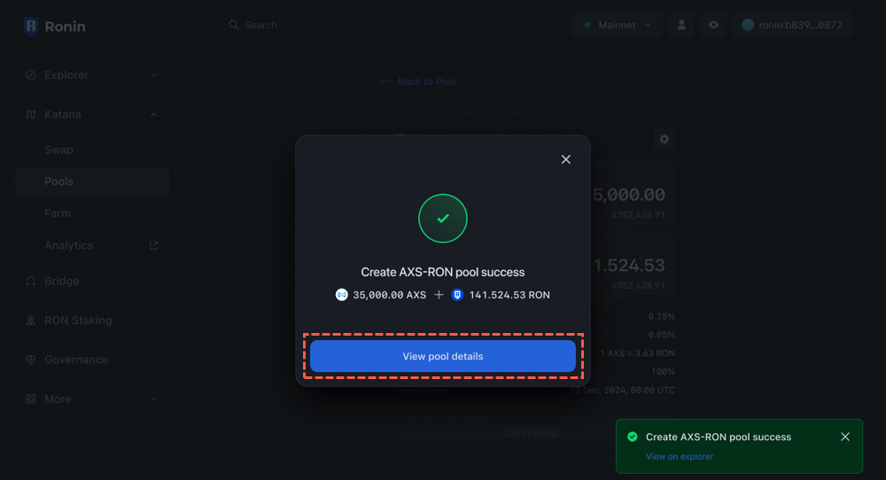
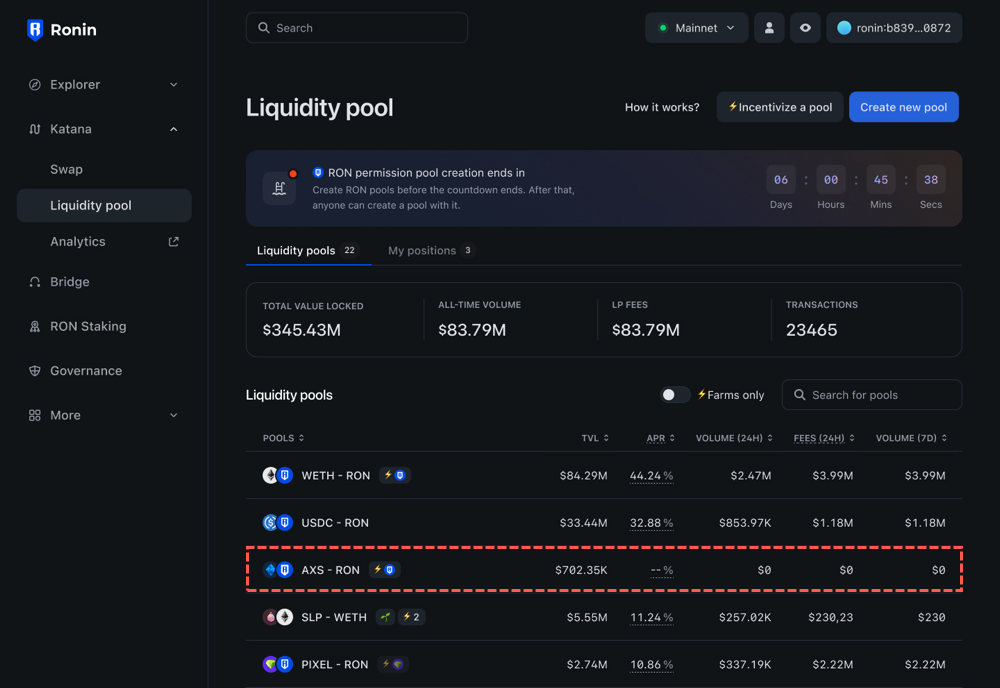

## Overview

You can create your own liquidity pools (LP) on Katana, contribute your liquidity to existing pools, and earn trading fees from the resulting transactions. This guide explains how to create a new pool, add liquidity to an existing pool, and remove liquidity from a pool.

When creating a new pool, you choose two tokens to pair together. These tokens can be any ERC-20 tokens, including ["main" and "seed" tokens](../overview.mdx#trade-main-and-seed-tokens). The system deposits your tokens into a smart contract, effectively increasing the pool's liquidity.

For example, if you decide to contribute to the AXS-RON pool, you need to
deposit an equivalent value of both tokens. Say the value of 1 AXS is USD 7.17 and the value of 1 RON is USD 2.72. If you want to provide 1 AXS into the AXS-RON pool, you also need to provide around 2.7 AXS.

In recognition of your
contribution, you receive _liquidity pool (LP) tokens_, which represent your share in the pool.

These tokens not only signify your stake but also entitle you to a portion
of the trading fees generated by the pool's transactions, directly
proportional to your contribution. These fees are added to pool and accrue in real-time. You can claim them by withdrawing your liquidity.

Be aware that earning a profit through providing liquidity isn't guaranteed.
You may face what's known as _impermanent loss_, a risk that arises from
fluctuations in the value of the deposited tokens.

### Katana V2 vs Katana V3

Katana V2 is a previous version of the Katana smart contract, which is still operational. Katana V3 is the latest version, which introduces concentrated liquidity, fee tiers, and improved oracles. When creating a liquidity pool, you can [choose to use](../overview.mdx#switch-between-v2-and-v3) either Katana V2 or Katana V3.

#### Fee tiers

  
Learn more about fee tiers

**What are fee tiers**

Fee tiers in Katana V3 are different fee structures that accommodate different types of trading pairs. When you create a liquidity pool, you can choose the fee structure that best match your risk/reward preferences and market conditions.

**How to choose the right fee tier**

When choosing a fee tier, consider the volatility of the tokens you're pooling. The higher the volatility, the higher the fee tier you should choose. Here are the available fee tiers:

| Fee tier | Fee breakdown | Best for |
| --- | --- | --- |
| 0.01% Fees | 0.005% LP fee + 0.005% Ronin Treasury fee | Stablecoin pairs |
| 0.3% Fees | 0.25% LP fee + 0.05% Ronin Treasury fee | Most trading pairs |
| 1% Fees | 0.85% LP fee + 0.15% Ronin Treasury fee | High-volatility pairs |

#### Concentrated liquidity

  
Learn more about concentrated liquidity

**What is concentrated liquidity**

Concentrated liquidity is a feature that allows liquidity providers to allocate their liquidity within a specific price range. This way, LPs can improve the capital efficiency of the pool.

**How to set a price range for your liquidity pool**

Choosing the right price range for your liquidity pool is essential to maximize capital efficiency and returns. The price range determines where your liquidity will be concentrated, and the efficiency of your liquidity is measured by the capital efficiency factor, as shown in the following table:

| Price range | Capital efficiency factor |
| --- | --- |
| [0; ∞] | x1 |
| [0.1; 50] | x1.2682 |
| [25; 2500] | x1.4625 |
| [1000; 2000] | x6.2852 |
| [30; 40] | x14.4102 |
| [3; 3.5] | x26.4518 |
| [0.999; 1.001] | x2000.4994 |

**What is capital efficiency**

Capital efficiency refers to how well your liquidity is used within the specified price range. The higher the capital efficiency, the better your liquidity is concentrated, meaning your assets work harder within that range to generate returns.

For example:

* A price range of [0; ∞] provides a capital efficiency of x1, meaning it offers baseline efficiency but spreads liquidity thinly across all potential price points.
* A more concentrated range like [0.999; 1.001] has a capital efficiency of x2000.4994, meaning your liquidity is highly concentrated in a narrow range, making it extremely efficient but more susceptible to price movement outside that range.

**Choosing the right price range**

When selecting a price range for your liquidity pool, consider the following factors:

* Stablecoins or low-volatility assets: if you're providing liquidity for stablecoins or assets with historically low volatility, you might choose a very narrow range, such as [0.999; 1.001], to achieve maximum capital efficiency. This range maximizes efficiency because the price is unlikely to move significantly outside of this range.
* Moderately volatile assets: for more volatile assets, like some ERC-20 tokens, you may want to widen the price range. For example, a range like [3; 3.5] or [25; 2500] offers greater flexibility while still improving capital efficiency compared to the default [0; ∞] range.
* Highly volatile assets: For assets with high volatility, consider wider ranges such as [0.1; 50] or [30; 40]. These ranges offer balance between efficiency and the ability to capture price movements while reducing the risk of your liquidity becoming inactive (if prices move outside the range).

**Trade-off between capital efficiency and price range**

Narrower ranges (such as [0.999; 1.001]) provide the highest capital efficiency, but they come with the risk that the price might move outside your range, rendering your liquidity inactive. Broader ranges (such as [25; 2500]) offer wider coverage and reduce the likelihood of price moving outside your range, but at the cost of lower capital efficiency.

**Monitoring and adjusting your price range**

You should regularly monitor the market prices of the tokens in your pool. If the price moves outside the range you've set, your liquidity will no longer be active, and you won't earn fees. In this case, you may need to adjust your price range to ensure your liquidity remains active and efficient.

## Prerequisites

* To provide liquidity on Katana, you need to have tokens in your Ronin Wallet. You can acquire tokens by depositing from Ethereum using [Ronin Bridge](https://app.roninchain.com/bridge), buying tokens through the [Purchase](https://purchase.roninchain.com) website, or receiving tokens from other users.
For more information, see [Acquire RON](../../../basics/acquire-ron.mdx).
* Token creators: to create a liquidity pool with your token on Katana, you need to meet the following requirements:
  * Have your ERC-20 token contract deployed to Ronin.
  * Have your token reviewed by Sky Mavis.
  * Have your Ronin address whitelisted by Sky Mavis. This address is linked to your token contract after the deployment is approved.

## Launch your ERC-20 token

:::info Note
This section is for token creators launching their own ERC-20 tokens on Katana. If you're a liquidity provider looking to create an LP with existing tokens, go to [Create a liquidity pool](#create-a-liquidity-pool).
:::

If you're a token creator, you can launch your own ERC-20 token on Katana and create a liquidity pool with it. This is a unique opportunity to bootstrap liquidity for your tokens and incentivize trading. By creating a pool, you provide a platform for users to trade your token with other tokens, increasing its utility and value.

During an initial whitelisting period, only you as the owner of the Ronin address that deployed the ERC-20 token can create liquidity pools with your token. After the whitelisting period ends, users can contribute liquidity to your pool or create their own pools with your token.

After creating a liquidity pool, you can [create a farm](create-farm.mdx) to encourage users to contribute liquidity to your pool.

### Write an ERC-20 token contract

To create a token, we recommend that you use the [OpenZeppelin ERC-20](https://docs.openzeppelin.com/contracts/5.x/erc20) contract. This way, you don't have to write the contract from scratch. Instead, you import the library and use its functions.

Your token contract MUST strictly follow the [ERC-20 token standard](https://eips.ethereum.org/EIPS/eip-20) and our smart contract guidelines. For more information, refer to [Smart contract guidelines](https://docs.skymavis.com/ronin/smart-contracts/reference/guidelines).

### Deploy the contract to Ronin

Deploy your token contract to the Ronin network. Make sure to test your contract on the Saigon testnet before deploying it to the Ronin mainnet.

For more information, refer to [Deploy a smart contract on Ronin](https://docs.skymavis.com/ronin/smart-contracts/overview).

### Submit token address and publish timestamp

Submit the following information to your Sky Mavis partner engineer:

* Deployer Ronin address for LP creation.
* Publish timestamp for your token.
* ERC-20 token contract address.
* Deployer Ronin address for farm creation if different from the LP creation address.

Sky Mavis reviews your ERC-20 token contract to ensure it meets the requirements. If the contract is approved, Sky Mavis maps your LP creation Ronin address with the contract address. This makes the token visible to you on Katana, where you can create pools with it.

## Create a liquidity pool

### Create a pool in Katana V3

1. Go to [Katana](https://app.roninchain.com/liquidity) and connect your Ronin Wallet.
2. Select the **Liquidity pool** page, then click **Create new pool**.
3. Select the version of Katana you want to use: **Position V3**.
  
4. Select the tokens you want to pool, then choose the fee tier. For more information, see [Fee tiers](#fee-tiers).
5. Enter the start price and set the price range for your liquidity pool by entering the minimum and maximum prices. For more information, see [Concentrated liquidity](#concentrated-liquidity).
6. Enter the amount of tokens you want to contribute to the pool. You may need to approve both tokens in your Ronin Wallet if you interact with them for the first time.
7. Click **Confirm** to finalize pool creation.
8. Click **Deposit**.
9. Click **Add liquidity**.

Your pool is now created.

### Create a pool in Katana V2

1. Go to [Katana](https://app.roninchain.com/liquidity) and connect your Ronin Wallet.
2. Select the **Liquidity pool** page, then click **Create new pool**.
  
3. Select the version of Katana you want to use: **Position V2**.
4. Select the tokens you want to pool, then enter the amount. You may need to approve both tokens in your Ronin Wallet if you interact with them for the first time. Token creators: select your token from the list. When selecting the token, you see its publish date at the bottom. This date signifies when the whitelisting period ends
  
4. Click **Confirm** to finalize pool creation.
  
5. Review the details of your liquidity contribution:
    * The amount of tokens you are contributing.
    * The amount of LP tokens you receive in return.
    * The exchange rate.
    * The share of the pool you receive, which is 100% for a pool creator.
    * Token creators: the publish date of the token, which signifies when the whitelisting period ends.

    Click **Create pool & Supply**, then confirm the transaction in your Ronin Wallet.
  

Your pool is now created. 

Token creators: your pool is in a scheduled state, visible only to you.

As long as the pool is in a scheduled state, only you can see it.

On the publishing date, the pool becomes available for all Katana users to contribute liquidity to. As a liquidity provider, you start earning fees from the pool's transactions.

You can also create a farm for your token. For more information, see [Create a farm](create-farm.mdx).

## Edit a liquidity pool

You can change the initial amount of tokens in a pool as long as the pool is in a scheduled state.

1. On the **Liquidity pool** page, select the pool you want to edit.
2. Add or remove tokens from the pool. For more information, see [Add liquidity to a pool](add-liquidity.mdx).
3. Click **Confirm**, review the details, then confirm the transaction in your Ronin Wallet.

## Migrate liquidity from V2 to V3

To achieve better capital efficiency, you can consider migrating your liquidity from Katana V2 to Katana V3.

1. On the **Liquidity pool** page, select Migrate.
2. Next to the pool you want to migrate, click **Migrate**.
3. Choose the fee tier you want to use for the pool or keep the existing fee tier.
4. Set the price range for your liquidity.

## See also

* [Add liquidity to a pool](add-liquidity.mdx)
* [Create a farm](create-farm.mdx)
* [Farm tokens](stake-tokens.mdx)
