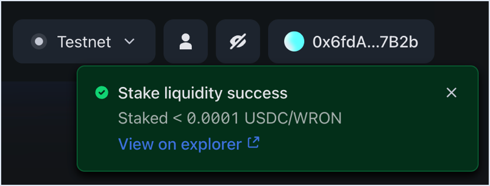
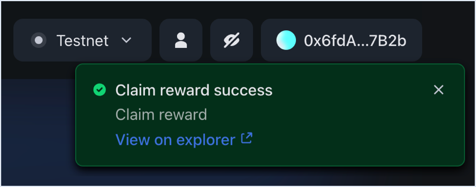
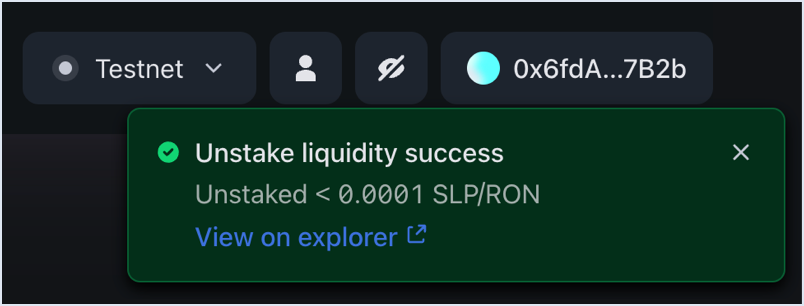

## Overview

You can stake liquidity pool (LP) tokens on Katana to farm RON. Farming is the process of providing liquidity to a pool and earning farm rewards in return. The farm rewards are distributed in the form of RON tokens. The more LP tokens you stake, the more RON you earn. Farming is available for a limited number of pools at any given time. You can see the list of pools that offer farm rewards by turning on the **Farms only** filter on the **Liquidity pool** page.

## Prerequisites

To farm RON on Katana, you need to have LP tokens in a pool that distributes farm rewards. To add LP tokens to a pool, see [Add a liquidity pair](pool.mdx#add-a-liquidity-pair).

## Start farming

1. Open [Katana](https://app.roninchain.com/swap) and connect your Ronin Wallet.
2. Select the **Liquidity pool** page, then turn on the **Farms only** filter to show the pools that offer farm rewards. All farming pools have a visual indicator with the lightning and RON symbol to the right side of the pool name.

    

3. Select the pool you want to farm RON from, then click the **Farm rewards** tab, and then select **Stake**. This opens the **Stake** panel for staking your LP tokens. In the **My position** panel, you can see how many tokens you have staked and how many are available in your wallet.
  
    

    **Note:** If you interact with the LP token for the first time, you need to approve it. Click **Approve**, then confirm the transaction in your Ronin Wallet.

6. Enter the amount of LP tokens you want to stake. You can also click **Max** to stake the maximum amount of LP tokens you have in this pool. When you're ready, click **Stake** and confirm the transaction in your Ronin Wallet.

    

Your transaction is now submitted to the blockchain. When it completes, Katana displays a confirmation pop-up. Close it or click **View on explorer** to see the detailed information about the transaction.

After staking, you can see an update in your total LP tokens staked and available in wallet.

Congratulations, you are now farming RON on Katana.

## Claim farm rewards

### Claim from the My positions tab

Open the **Liquidity pool** page, then select **My positions**, and then click **Claim** next to the pool you want to claim rewards from.

### Claim from the Farm rewards tab

Select the pool to claim rewards from, then open the **Farm rewards** tab, and then click **Claim all**.

After clicking either of the buttons, confirm the transaction in your Ronin Wallet.

When the transaction completes, Katana displays a confirmation pop-up. Close it or click **View on explorer** to see the detailed information about the transaction.

## Stop farming

To stop farming, you need to unstake the LP tokens from a farm pool. Unstaking means that you stop receiving RON proportionate to how much LP tokens you unstake.

1. Select the pool you want to unstake from, then click the **Farm rewards** tab, and then select **Unstake**. This opens the **Unstake** panel for unstaking your LP tokens.

    

2. Enter the amount of LP tokens you want to unstake. You can also click **Max** to unstake all your LP tokens. When you're ready, click **Unstake** and confirm the transaction in your Ronin Wallet.

    

Your transaction is now submitted to the blockchain. When it completes, Katana displays a confirmation pop-up. Close it or click **View on explorer** to see the detailed information about the transaction.

After unstaking, you can see an update in your total LP tokens staked and available in wallet reflective of the changes you made.

Congratulations, you have successfully stopped farming RON on Katana.