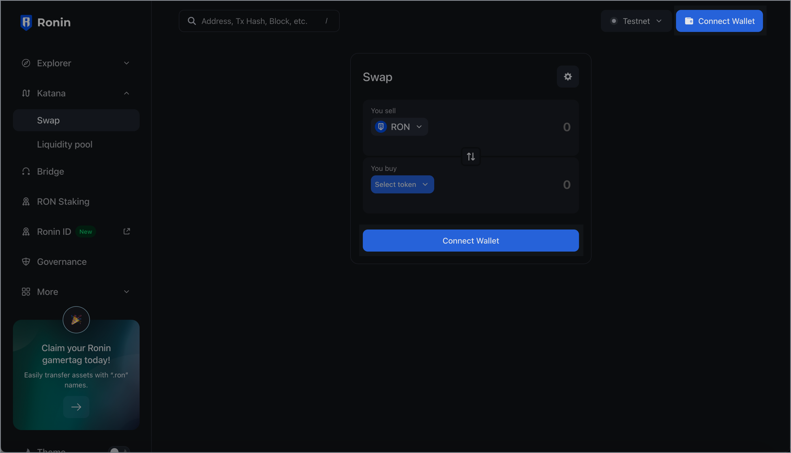

import approveTokens from '../assets/katana-approve-tokens.png'
import connectWallet from '../assets/katana-connect-wallet.png'
import connectWalletTerms from '../assets/katana-connect-wallet-terms.png'
import walletBalance from '../assets/katana-wallet-balance.png'
import walletOptions from '../assets/katana-wallet-options.png'

## Overview

Before you can start using the Katana DEX, you'll need to have a Ronin wallet and activate it through the Axie marketplace.

## Get started

### Step 1. Download and set up Ronin Wallet

Download and install your Ronin Wallet by following the instructions on the [Ronin Wallet Overview](https://support.roninchain.com/hc/en-us/articles/21919788607131-Ronin-Wallet-Overview) page.
You should install both the Ronin Wallet browser extension and mobile app. 

### Step 2. Set up your Mavis Account

Create your Mavis Account by following the instructions in the [Setup your Mavis Account](https://support.axieinfinity.com/hc/en-us/articles/4405373226779-Getting-Started-with-Axie-Infinity#h_01HTCKHNRGFXG8K7HQ33YK37A5) guide.

## Log in to Katana

1. Open the [Katana Swap](https://app.roninchain.com/swap) page.
2. Connect your Ronin Wallet by pressing either of the **Connect Wallet** buttons.
    
3. Select Next, then read the permission requests, and then select **Connect**.

You are now connected to the Katana DEX.

## Check wallet balance

When you're logged in, you can see the amount of RON you own and the wallet address you're connected to.

Click the options in the top right-hand corner to view more details:

* The user icon: this opens the page for your connected address in the Explorer.
* The connected address: this allows you to copy the address or disconnect your Ronin Wallet from the Katana DEX and Ronin app itself.

## Approve tokens

When a smart contract first interacts with a token in your wallet, it asks for your permission. You're prompted once for each token, and these prompts appear visibly before you can continue with your desired actions. 

For example, to swap USDC for PIXEL, you need to approve the USDC token first. Click **Approve**, then confirm the transaction in your Ronin Wallet.

