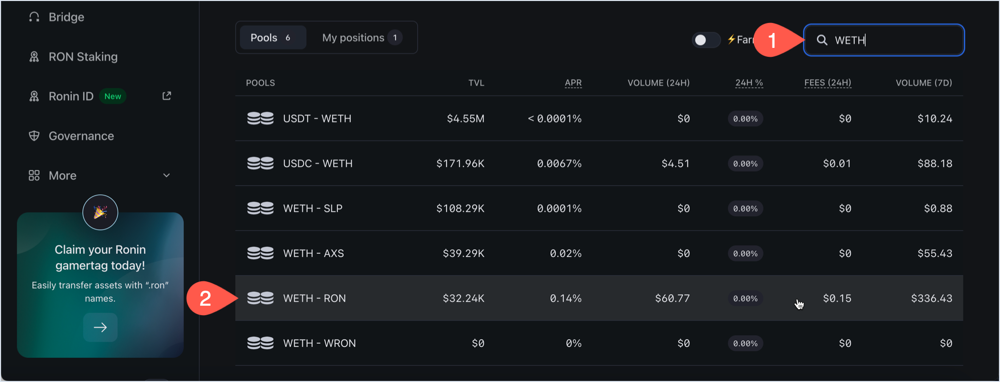
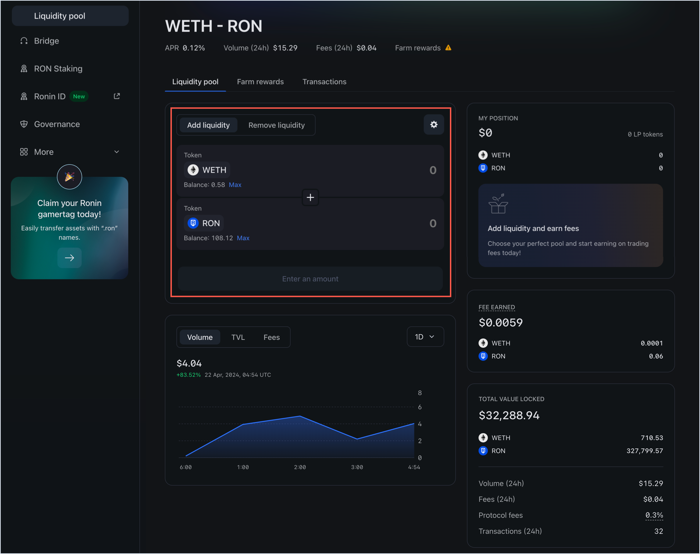
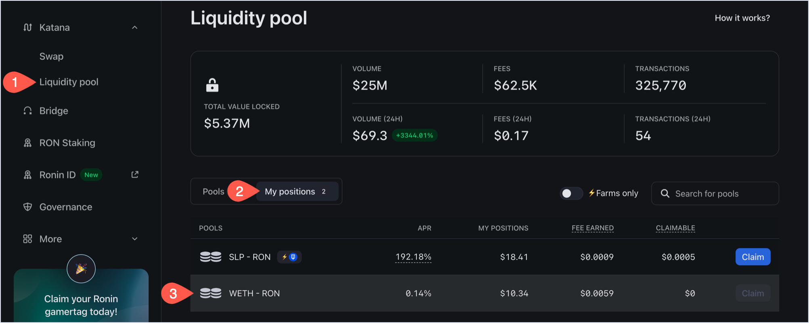

## Overview

You can contribute funds to liquidity pools (LP) on Katana, enabling you to earn trading fees from the resulting
transactions.

By engaging as a liquidity provider, you deposit pairs
of tokens into a smart contract, effectively increasing the pool's liquidity.

For example, if you decide to support the WETH-AXS pool, you need to
contribute an equivalent value of both tokens. Say the value of 1 WETH is USD 3,200.00 and the value of 1 AXS is USD 7.70. If you want to provide 1 WETH into the WETH-AXS pool, you also need to provide around 415 AXS.

In recognition of your
contribution, you receive _liquidity pool tokens_, which represent your share in the pool.

These tokens not only signify your stake but also entitle you to a portion
of the trading fees generated by the pool's transactions, directly
proportional to your contribution. These fees are added to pool and accrue in real-time. You can claim them by withdrawing your liquidity.

Be aware that earning a profit through providing liquidity isn't guaranteed.
You may face what's known as _impermanent loss_, a risk that arises from
fluctuations in the value of the deposited tokens.

## Prerequisites

To provide liquidity on Katana, you need to have tokens in your Ronin Wallet. You can acquire tokens by depositing from Ethereum using [Ronin Bridge](https://app.roninchain.com/bridge), buying tokens through the [Purchase](https://purchase.roninchain.com) website, or receiving tokens from other users.
For more information, see [Acquire RON](../../../basics/acquire-ron.mdx).

## Add a liquidity pair

1. Open [Katana](https://app.roninchain.com/swap) and connect your Ronin Wallet.
2. Select the **Liquidity pool** page. You can see a list of available pools, each consisting of two tokens.
    
    
3. Search for the pool you want to contribute to, then select it. You can search by the token's symbol or name.
    
    
    
    This opens the **Liquidity pool** tab with a token pair panel for providing liquidity. It looks similar to the swap panel, except you see a plus sign (+) between the two tokens instead of an arrows sign. This symbolizes that you are adding both tokens into a pool.
    
    
  
    The other information about the pool includes the following:
    * **My position**: the amount of LP tokens you have in the pool and the ERC20 tokens you contributed. The values are zero if you haven't contributed yet.
    * **Fee earned**: the fees earned from asset trading in this pool.
    * **Total value locked**: the total value of the pool, including the volume, fees, and transactions for the last 24 hours. 
    * Charts showing the pool's performance over time: volume, total value locked, and fees.

5. Enter the amount of tokens you want to contribute. Katana automatically calculates the equivalent amount of the other token based on the current exchange rate. You can also click **Max** to deposit the maximum amount of tokens you have in your wallet. If everything checks out, click **Add**.

    

    **Note:** If you interact with the tokens for the first time, you need to approve them. Click **Approve**, then confirm the transaction in your Ronin Wallet.

6. Review the details of your liquidity contribution:
    * The amount of LP tokens you will get in return.
    * The amount of tokens you are contributing.
    * The share of the pool you will receive.

    Click **Confirm add liquidity**, then confirm the transaction in your Ronin Wallet.

   

Your transaction is now submitted to the blockchain. When it completes, Katana displays a confirmation pop-up. Close it or click **View on explorer** to see the detailed information about the transaction.

The **My position** panel is now updated with your latest contribution:

* The amount of ERC 20 tokens you contributed.
* The amount of LP tokens received in return.

Congratulations, you are now a liquidity provider on Katana. You can now earn fees from the pool's transactions. If the pool supports farming, you can also stake your LP tokens to farm RON. For more information, see [Farm](#farm).

## View your positions

To see all the pools you contributed to and the fees earned, open the **Liquidity pool** page, then select **My positions**.

Here you can see the following information:

* The pools to which you contributed.
* The APR (annual percentage rate) for each pool.
* Your position in each pool.
* The fees you earned from each pool.
* Your claimable rewards from farming, if the pool supports it.

To view more details, such as the amount of LP tokens and the pool's performance over time, select each pool.

## Remove a liquidity pair

Removing pool tokens converts your position back into underlying tokens at the current rate, proportional to your share of the pool. Accrued fees are included in the amounts you receive.

1. Open the **Liquidity pool** page, then select the **My positions** tab, and then click the pool you want to withdraw from:

    

2. Select the **Remove liquidity** panel.

    

    **Note:** If you interact with the tokens for the first time, you need to approve them. Click **Approve**, then confirm the transaction in your Ronin Wallet.

3. Enter the amount of LP tokens you want to withdraw. You can also click **Max** to withdraw all your LP tokens. If everything checks out, click **Remove**. 

    

4. Depending on the amount, you can see how much you're getting when removing liquidity. To confirm the withdrawal, click **Confirm remove liquidity**, then confirm the transaction in your Ronin Wallet.

    

Your transaction is now submitted to the blockchain. When it completes, Katana displays a confirmation pop-up. Close it or click **View on explorer** to see the detailed information about the transaction.

The **My position** panel is now updated with your latest position after removing liquidity:

You have now removed your liquidity by removing your LP tokens, and have gotten your tokens with the accrued fees, proportionate to your shares. Thank you for your service.
