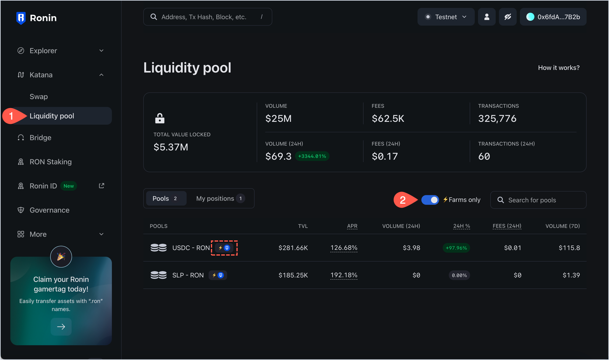
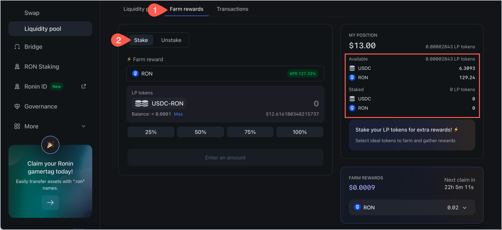
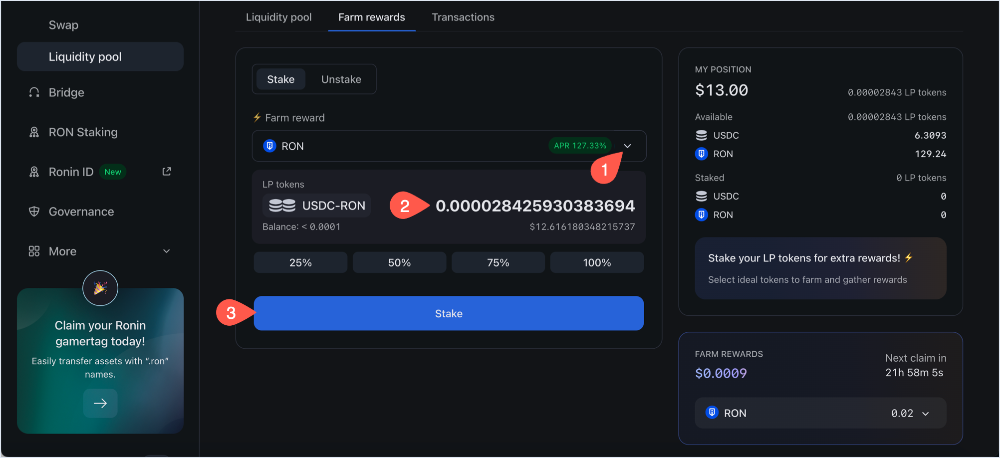
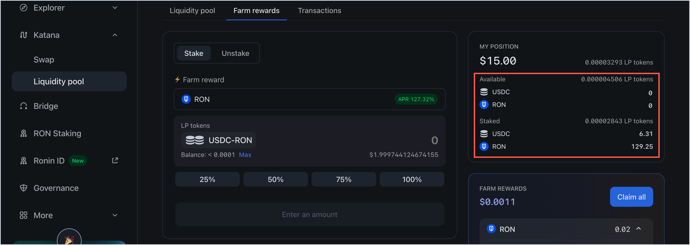
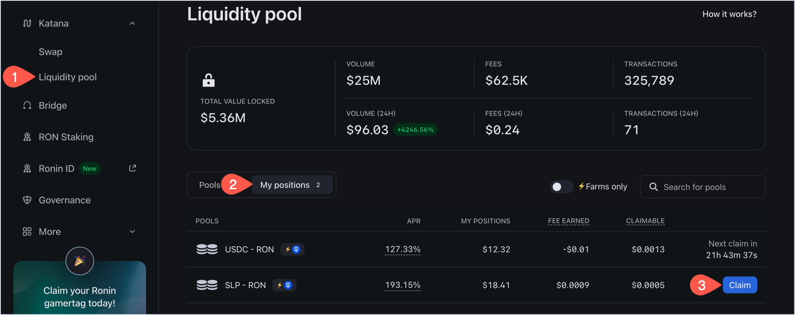
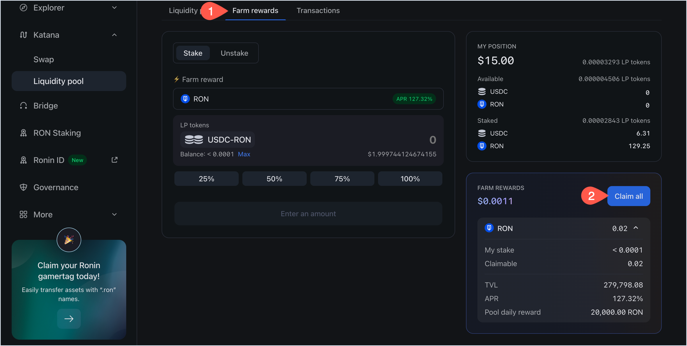
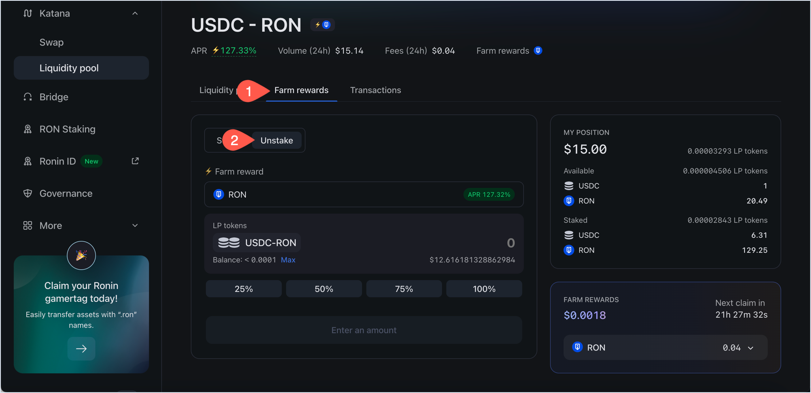
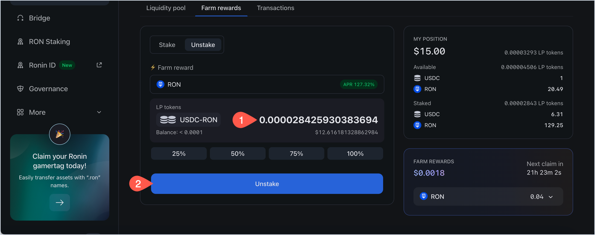
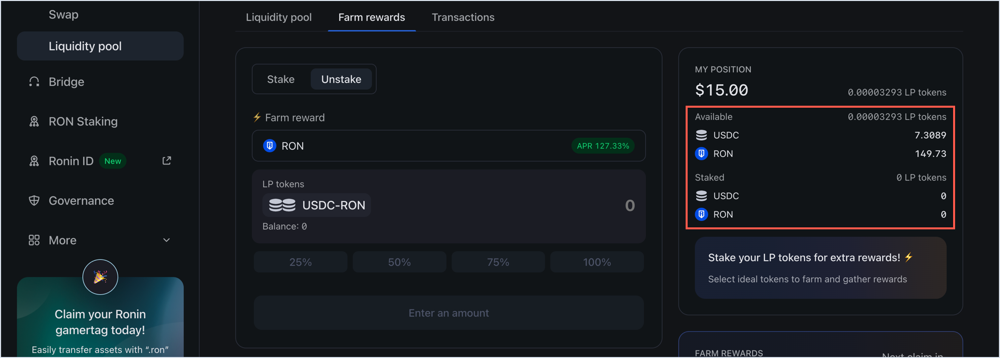

import katanaFarmClaimSuccess from '../assets/katana-farm-claim-success.png';
import katanaFarmStakeSuccess from '../assets/katana-farm-stake-success.png';
import katanaFarmUnstakeSuccess from '../assets/katana-farm-unstake-success.png';

## Overview

When you provide liquidity to a pool on Katana, you receive liquidity pool (LP) tokens in return. You can stake these LP tokens in a farm to earn rewards in the form of another ERC-20 token, which is chosen by the farm creator. A farm can offer more than one reward token to choose from. Generally, the more LP tokens you stake, the more reward tokens you earn. Farming is available for a limited number of pools at any given time.

## Prerequisites

To farm tokens on Katana, you need to have LP tokens that you can stake. To acquire LP tokens, add your liquidity to a pool. For more information, see [Add liquidity to a pool](add-liquidity.mdx).

## Start farming

1. Open [Katana](https://app.roninchain.com/swap) and connect your Ronin Wallet.
2. Select the **Liquidity pool** page, then turn on the **Farms only** filter to show the pools that offer farm rewards. All farming pools are displayed with a yellow lightning symbol and RON icon to the right side of the pool's name.

    

3. Select the pool you want to farm tokens in, then click the **Farm rewards** tab, and then select **Stake**. This opens the **Stake** panel for staking your LP tokens. In the **My position** panel, you can see how many tokens you have staked and how many are available in your wallet.
  
    

6. Select the reward token, then enter the amount of LP tokens you want to stake, and then click **Stake**.

    

Confirm the transaction in your Ronin Wallet. When the transaction completes, Katana displays a confirmation pop-up.

After staking, you can see an update in your total LP tokens staked and available in wallet.

Congratulations, you are now farming tokens on Katana.

## Claim reward tokens

You can claim rewards from the list of your positions or from the pool's details page.

### Claim from My positions

Open the **Liquidity pool** page, then select **My positions**, and then click **Claim** next to the pool you want to claim rewards from.

Confirm the transaction in your Ronin Wallet. When the transaction completes, Katana displays a confirmation pop-up.

### Claim from individual pool

Select the pool to claim rewards from, then in the **Farm Rewards** section, click **Claim**.

Confirm the transaction in your Ronin Wallet. When the transaction completes, Katana displays a confirmation pop-up.

## Stop farming

To stop farming, you need to unstake the LP tokens from a farm pool. Unstaking means that you stop receiving reward tokens proportionate to how much LP tokens you unstake.

1. Select the pool you want to unstake from, then click the **Farm rewards** tab, and then select **Unstake**. This opens the **Unstake** panel for unstaking your LP tokens.

    

2. Enter the amount of LP tokens you want to unstake, then click **Unstake**.

    

Confirm the transaction in your Ronin Wallet. When the transaction completes, Katana displays a confirmation pop-up.

After unstaking, you can see an update in your total LP tokens staked and available in wallet reflective of the changes you made.

Congratulations, you have successfully stopped farming tokens on Katana.
