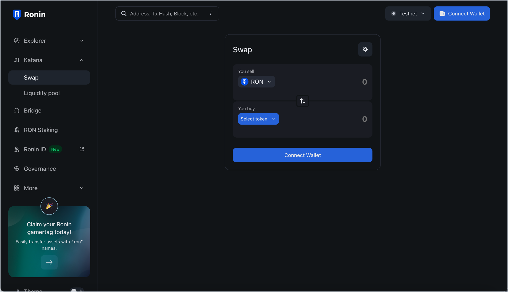
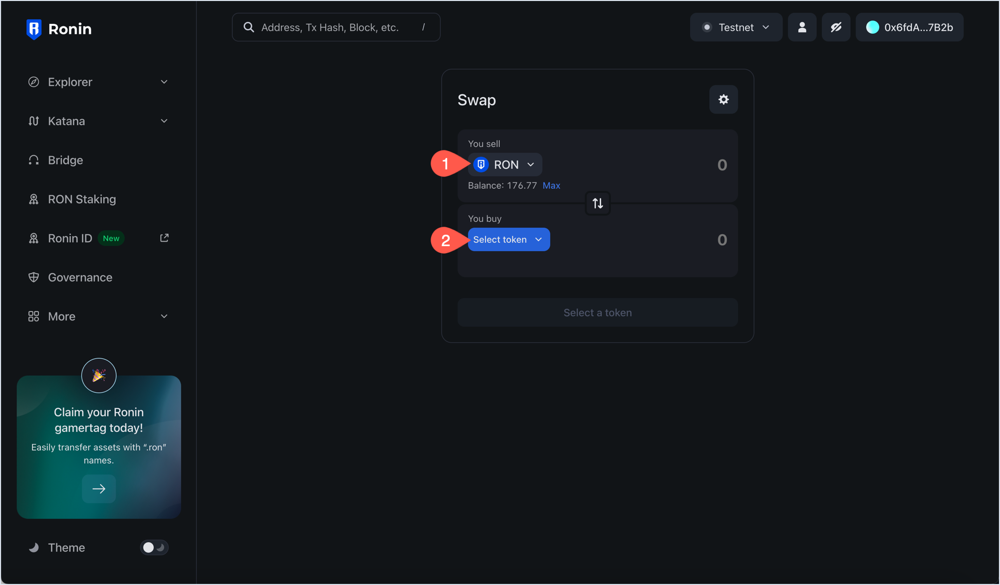
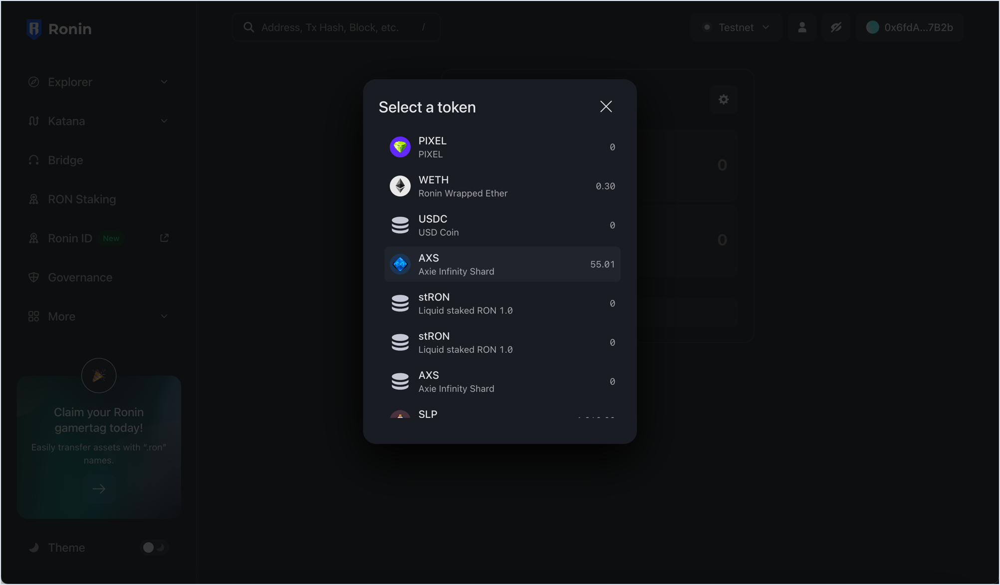
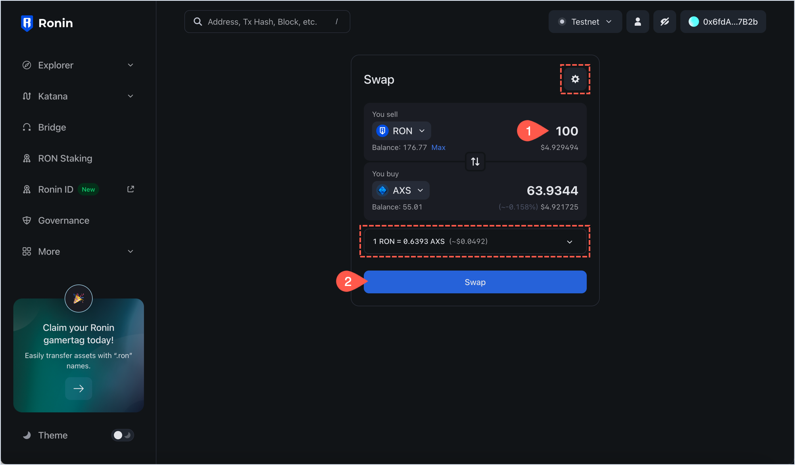
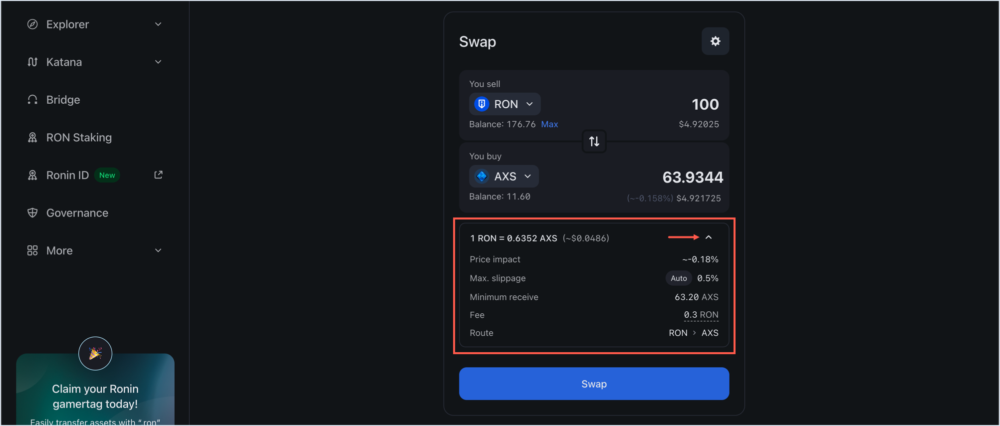
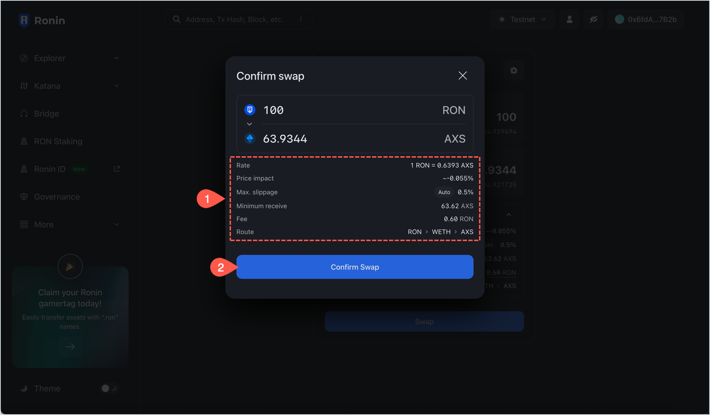
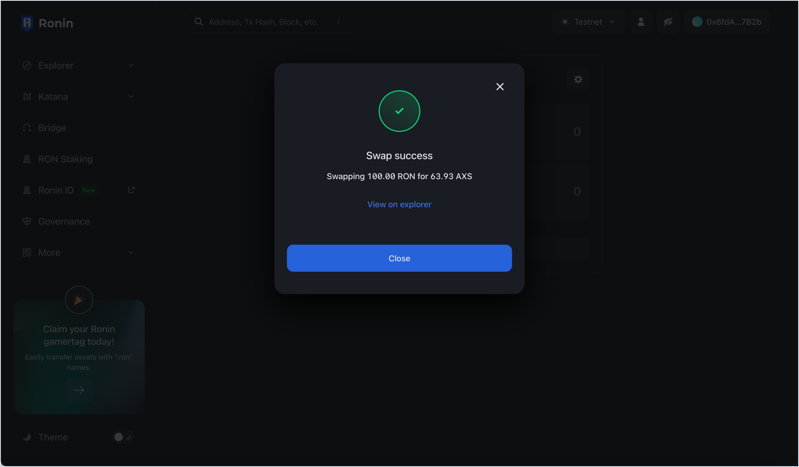
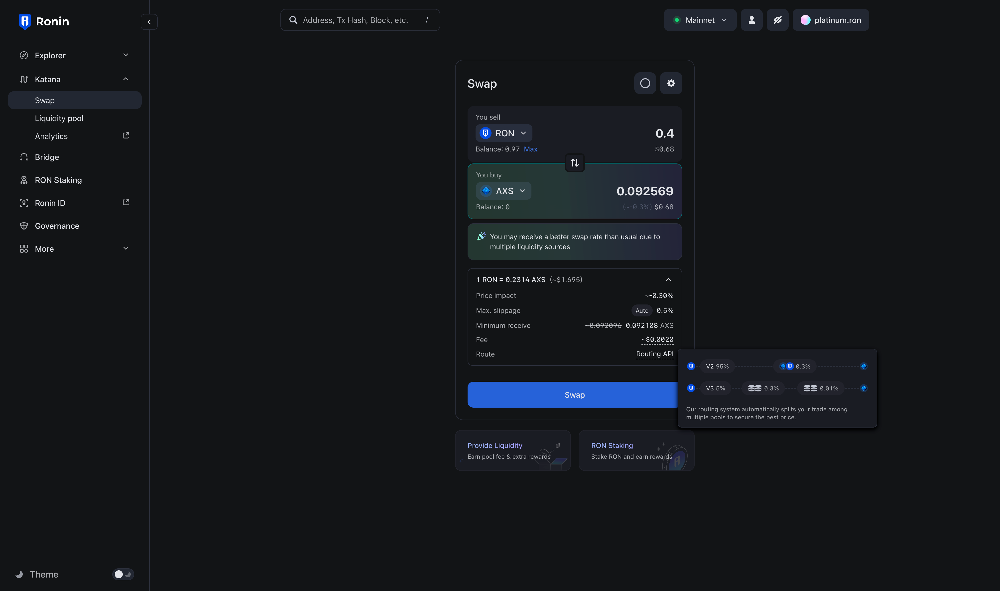
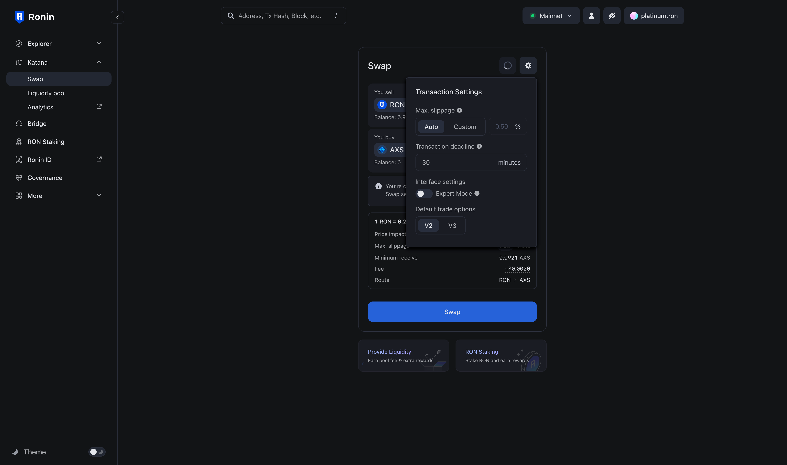

import roninWalletSwapSearch from '../assets/ronin-wallet-swap-search.png'
import roninWalletSwapFrom from '../assets/ronin-wallet-swap-from.png'
import roninWalletSwapToList from '../assets/ronin-wallet-swap-to-list.png'
import roninWalletSwapTo from '../assets/ronin-wallet-swap-to.png'
import roninWalletSwapDetails from '../assets/ronin-wallet-swap-details.png'
import roninWalletSwapReviewDetails from '../assets/ronin-wallet-swap-review-details.png'
import roninWalletSwapCompleted from '../assets/ronin-wallet-swap-completed.png'

## Overview

You can trade one token for another on Katana in a process known as swapping. When swapping tokens, you sell the currently owned tokens for the proportional amount of the tokens that you want to buy, minus the swap fee. The swap fee is awarded to liquidity providers (LPs).

### Swap on Ronin app vs Ronin Wallet

There are two ways to swap on Ronin: the [Swap](https://app.roninchain.com/swap) page in the Ronin web app and the Wallet Swap feature in the [Ronin Wallet](https://wallet.roninchain.com) mobile app and browser extension. The process is similar in both, but the interface differs slightly.

### Swap fees in Katana V2 vs V3

The fees for swapping tokens will be applied in each pool that the swap path passes through. Depending on whether the pool is Katana V2 or Katana V3, there will be different corresponding fee rates. This swap fee is always paid in the *input token*.

#### Katana V2 pools

| Fee amount | Fee breakdown |
| --- | --- |
| 0.3% | 0.25% LP fee + 0.05% Ronin Treasury fee |

#### Katana V3 pools

| Fee tier | Fee breakdown | Used for |
| --- | --- | --- |
| 0.01% | 0.005% LP fee + 0.005% Ronin Treasury fee | Stablecoin pairs |
| 0.3% | 0.25% LP fee + 0.05% Ronin Treasury fee | Most trading pairs |
| 1% | 0.85% LP fee + 0.15% Ronin Treasury fee | High-volatility pairs |

When using Wallet Swap, a development fee of 0.5% is added to the total fee in the *output token*.

## Prerequisites

To swap tokens, you need to have them in your Ronin Wallet. You can acquire tokens by depositing from Ethereum using [Ronin Bridge](https://app.roninchain.com/bridge), buying through the [Purchase](https://purchase.roninchain.com) page, or receiving from other users.
For more information, see [Acquire RON](../../../basics/acquire-ron.mdx).

## Swap in Ronin app

1. Open [Katana](https://app.roninchain.com/swap) and connect your Ronin Wallet. The **Swap** page opens by default.
    
2. Choose the tokens you want to swap from and to.
    
    
    You can click either of the token selection boxes to reveal the full list of supported tokens.
    
    
3. Enter the amount to swap by typing in either of the token selection boxes. When you type in on one of them, the other populates based on the current exchange rate between the tokens. When you are ready to swap, click **Swap**.

    

    To view detailed information about the swap before proceeding, expand the exchange rate box above the **Swap** button.

    

4. In the **Confirm Swap** pop-up, review the details of your swap:
    * **Rate**: The exchange rate between the tokens.
    * **Price impact**: estimation of the slippage to expect based on your order size and market movements. This gives you an idea of how much you can receive.
    * **Max. slippage**: the highest percent of price movement of the transaction. Anything greater than this value results in a failed transaction.
    * **Minimum receive**: the lowest amount of tokens you can receive based on slippage tolerance. This is the worst-case scenario. Anything less than this value results in a failed transaction.
    * **Liquidity provider fee**: the fees allocated to liquidity providers.
    * **Route**: the trading route taken for your order. It can be a direct "token A to token B" route, or there might be a bridge token in the middle, such as "token A through token B to token C." The direct route might not always be the cheapest.
    
    When you're ready, click **Confirm Swap**, then confirm the transaction in your Ronin Wallet.
    

Your transaction is now submitted to the blockchain. When it completes, Katana displays a confirmation pop-up. Close it or click **View on explorer** to see the detailed information about the transaction.

Congratulations. You just swapped your tokens on Katana.

## Swap tokens in Wallet Swap

This section describes how to swap tokens using Wallet Swap in the Ronin Wallet mobile app. The process for the browser extension is similar.

1. In the Ronin Wallet app, tap **DAPPS**, then search for "Swap."
    
    
2. Choose the tokens you want to swap from and to.

    
    You can click either of the token selection boxes to reveal the full list of supported tokens.
    

3. Enter the amount to swap by typing in either of the token selection boxes. When you type in on one of them, the other populates based on the current exchange rate between the tokens. When you are ready to swap, tap **Swap**.
    

    To view detailed information about the swap before proceeding, expand the exchange rate box above the Swap button.
    

6. On the **Confirm swap** screen, review the details of your swap:
    * **Rate**: the exchange rate between the tokens.
    * **Price impact**: estimation of the slippage to expect based on your order size and market movements. This gives you an idea of how much you can receive.
    * **Max. slippage**: the highest percent of price movement of the transaction. Anything greater than this value results in a failed transaction.
    * **Minimum receive**: the lowest amount of tokens you can receive based on slippage tolerance. This is the worst-case scenario. Anything less than this value results in a failed transaction.
    * **Liquidity provider fee**: the fees allocated to liquidity providers.
    * **Route**: the trading route taken for your order. It can be a direct "token A to token B" route, or there might be a bridge token in the middle, such as "token A through token B to token C." Direct route might not always be the cheapest.
    
    When you're ready, tap **Confirm Swap**, then confirm the transaction in your wallet.
    

Your transaction is now submitted to the blockchain. When it completes, Katana displays a confirmation pop-up. Close it or click **View on explorer** to see the detailed information about the transaction.

Congratulations. You just swapped your tokens using Wallet Swap.

## Smart order router
We use a smart order router combined with the updated router smart contract, which acts as an aggregator to provide access to a broader range of liquidity sources (including both Katana V2 pools and Katana V3 pools) for your swaps. This enable swap ratios compared to the previous router, which was limited to Katana V2 pools. 

    

This feature will be enabled by default as the  **Default trade options** is set as **Aggregator**. If you prefer to use the old router, navigate to **Transaction Settings** and set the **Default trade options** to **Legacy**.

    
