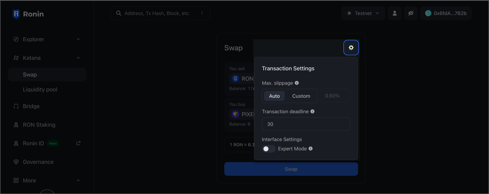

import katana from './assets/katana.png'
import approveTokens from './assets/katana-approve-tokens.png'
import startingPage from './assets/katana-starting.png'
import walletBalance from './assets/katana-wallet-balance.png'
import walletOptions from './assets/katana-wallet-options.png'

## Overview

Katana ([katana.roninchain.com](https://app.roninchain.com/swap)) is a decentralized exchange (DEX) for trading tokens within the Ronin ecosystem. 

## Key features

* [Swap](./guides/swap.mdx): easily swap between pairs of various ERC 20 tokens, including wrapping RON to wRON to make offers on Mavis Market and participate in Ronin token launches.
* [Pool](./guides/pool.mdx): provide liquidity for ERC 20 tokens and earn market-making fees.
* [Farm](./guides/farm.mdx): stake liquidity pool (LP) tokens to earn RON rewards.

## Feature availability

The following table shows the availability of features in Katana web and Ronin Wallet mobile app and browser extension.

|Feature|Katana web|Ronin Wallet|
|---|---|---|
|Swap|✅|✅\*|
|Pool|✅|❌|
|Farm|✅|❌|

\*Each swap transaction in the Ronin Wallet mobile app and browser extension incurs a development fee of 0.5% of the transaction value.

## Basics

### View your connected wallet

When you Ronin Wallet is connected to Katana, you can see the amount of RON you own and the wallet address you're connected to.

Click the options in the top right-hand corner to view more details:

1. Network switch: this allows you to switch between the Ronin mainnet and Saigon testnet networks.
2. User icon: this opens the page for your connected address in Ronin Chain Explorer.
3. Eye icon: this allows you to hide your wallet balance.
4. Connected address: this allows you to copy the address or disconnect your Ronin Wallet from Katana and the Ronin app itself.

### Approve tokens

When a smart contract first interacts with a token in your wallet, it asks for your permission. You're prompted once for each token, and these prompts appear visibly before you can continue with your desired actions. 

For example, to stake an SLP/WRON token pair, you need to approve it first. Click **Approve SLP/WRON**, then confirm the transaction in your Ronin Wallet.

### Customize transaction settings

When transacting on Katana or swapping on Ronin Wallet, you can fine-tune transaction settings. To access the settings, select the cog icon in the top right-hand corner of the transaction panel.

Here's what you can adjust:

1. **Max slippage**: set a custom maximum percentage difference between the expected price and the price at the time of the transaction.
2. **Transaction deadline**: set a custom time limit for the transaction to be completed.
3. **Expert mode**: enable high price-impact swaps and remove the confirmation step.
